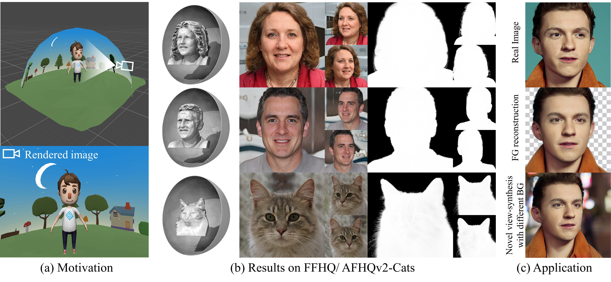

## BallGAN: 3D-aware Image Synthesis with a Spherical Background<br><sub>Official PyTorch implementation</sub>


> **3D-aware Blending with Generative NeRFs**<br>
> [Minjung Shin](https://minjung-s.github.io)<sup>1,2</sup>, Yunji Seo<sup>1</sup>, Jeongmin Bae<sup>1</sup>, Youngsun Choi<sup>1</sup>, [Hyunsu Kim](https://blandocs.github.io)<sup>2</sup>, [Hyeran Byun](http://cvpr.yonsei.ac.kr/member)<sup>1</sup><br>, [Youngjung Uh](https://vilab.yonsei.ac.kr/member/professor)<sup>1</sup><br>
<sup>1</sup>Yonsei University, <sup>2</sup>NAVER AI Lab

[**Project page**](https://minjung-s.github.io/ballgan) | [**Arxiv**](https://arxiv.org/abs/2301.09091) | [**ICCV 2023 Video**](https://youtu.be/RxdWbePtcNY)

> **Abstract:** *3D-aware GANs aim to synthesize realistic 3D scenes that can be rendered in arbitrary camera viewpoints, generating high-quality images with well-defined geometry. 
As 3D content creation becomes more popular, the ability to generate foreground objects separately from the background has become a crucial property.
Existing methods have been developed regarding overall image quality, but they can not generate foreground objects only and often show degraded 3D geometry. 
In this work, we propose to represent the background as a spherical surface for multiple reasons inspired by computer graphics. Our method naturally provides foreground-only 3D synthesis facilitating easier 3D content creation. Furthermore, it improves the foreground geometry of 3D-aware GANs and the training stability on datasets with complex backgrounds.*


The code heavily relays on [EG3D](https://github.com/NVlabs/eg3d/tree/main/eg3d).

## Requirements

* We recommend Linux for performance and compatibility reasons.
* 1&ndash;8 high-end NVIDIA GPUs. We have done all testing and development using V100, RTX3090.
* 64-bit Python 3.8 and PyTorch 1.11.0 (or later). See https://pytorch.org for PyTorch install instructions.
* CUDA toolkit 11.3 or later.  (Why is a separate CUDA toolkit installation required?  We use the custom CUDA extensions from the StyleGAN3 repo. Please see [Troubleshooting](https://github.com/NVlabs/stylegan3/blob/main/docs/troubleshooting.md#why-is-cuda-toolkit-installation-necessary)).
* Python libraries: see [environment.yml](./environment.yml) for exact library dependencies.  You can use the following commands with Miniconda3 to create and activate your Python environment:
  - `cd ballgan`
  - `conda env create -f environment.yml`
  - `conda activate ballgan`

## Getting started

You can download the pretrained models for both [FFHQ](https://drive.google.com/file/d/15ClBR8speg8wYjcoaHlsCkcN6hRZqVXY/view?usp=sharing) and [AFHQ](https://drive.google.com/file/d/14zm2QOKDaDxolM6R_D5shv11e1EpUSFp/view?usp=sharing).

Pre-trained networks are stored as `*.pkl` files that can be referenced using local filenames.


## Generating media
```.bash
# Generate rgb images, and rgba images and forground shapes (as .mrc files) using pre-trained model

python gen_samples.py --outdir=out --trunc=0.7 --shapes=true --seeds=0-3 \
    --network=networks/network_snapshot.pkl
```

We visualize our .mrc shape files with [UCSF Chimerax](https://www.cgl.ucsf.edu/chimerax/).

To visualize a shape in ChimeraX do the following:
1. Import the `.mrc` file with `File > Open`
1. Find the selected shape in the Volume Viewer tool
    1. The Volume Viewer tool is located under `Tools > Volume Data > Volume Viewer`
1. Change volume type to "Surface"
1. Change step size to 1
1. Change level set to 10
    1. Note that the optimal level can vary by each object, but is usually between 2 and 20. Individual adjustment may make certain shapes slightly sharper
1. In the `Lighting` menu in the top bar, change lighting to "Full"


## Dataset
We follow the same dataset format as [EG3D](https://github.com/NVlabs/eg3d/tree/main#preparing-datasets) supported on FFHQ and AFHQv2_cats, which can be either an image folder, or a zipped file.

## Train a new BallGAN model

You can train new networks using `train.py`. For example:

```.bash
# Train with FFHQ from scratch with raw neural rendering resolution=64, using 8 GPUs.
python train.py --outdir=~/training-runs --cfg=ffhq --data=~/datasets/FFHQ_512.zip \
  --gpus=8 --batch=32 --gamma=1 --gen_pose_cond=True

# Second stage finetuning of FFHQ to 128 neural rendering resolution (optional).
python train.py --outdir=~/training-runs --cfg=ffhq --data=~/datasets/FFHQ_512.zip \
  --resume=~/training-runs/ffhq_experiment_dir/network-snapshot-025000.pkl \
  --gpus=8 --batch=32 --gamma=1 --gen_pose_cond=True --neural_rendering_resolution_final=128

# Train with AFHQ, finetuning from FFHQ with ADA, using 8 GPUs.
python train.py --outdir=~/training-runs --cfg=afhq --data=~/datasets/afhq.zip \
  --gpus=8 --batch=32 --gamma=5 --aug=ada --neural_rendering_resolution_final=128 --gen_pose_cond=True --gpc_reg_prob=0.8
```
In the above examples, there are no regularizations applied. 

If you want to use regularization, set the desired values for  ```fg_density_reg```, ```fg_density_spatial_reg```,```density_reg```, and ```bg_transmittance_reg```.

## Metrics

```.bash
python calc_metrics.py --metrics=fid50k_full --data=~/datasets/ffhq_512.zip \
    --network=ffhq-128.pkl
```

## Citation
```
@InProceedings{Shin_2023_ICCV,
    author    = {Shin, Minjung and Seo, Yunji and Bae, Jeongmin and Choi, Young Sun and Kim, Hyunsu and Byun, Hyeran and Uh, Youngjung},
    title     = {BallGAN: 3D-aware Image Synthesis with a Spherical Background},
    booktitle = {Proceedings of the IEEE/CVF International Conference on Computer Vision (ICCV)},
    month     = {October},
    year      = {2023},
    pages     = {7268-7279}
}
```

