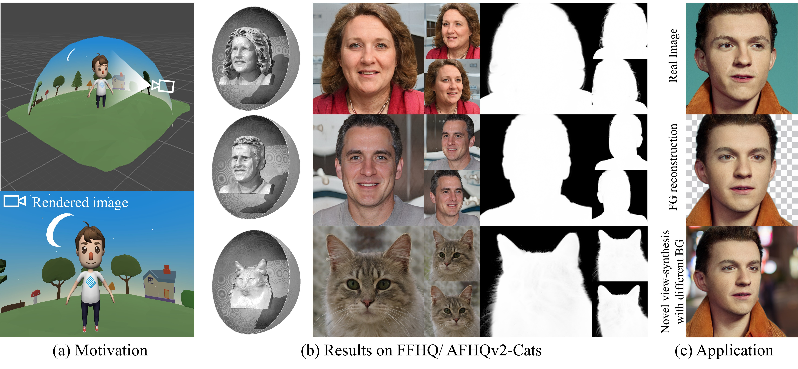

## BallGAN: 3D-aware Image Synthesis with a Spherical Background Official PyTorch implementation

> **3D-aware Blending with Generative NeRFs** 
> [Minjung Shin](https://minjung-s.github.io)1,2, Yunji Seo1, Jeongmin Bae1, Youngsun Choi1, [Hyunsu Kim](https://blandocs.github.io)2, [Hyeran Byun](http://cvpr.yonsei.ac.kr/member)1 , [Youngjung Uh](https://vilab.yonsei.ac.kr/member/professor)1 
1Yonsei University, 2NAVER AI Lab

[**Project page**](https://minjung-s.github.io/ballgan) | [**Arxiv**](https://arxiv.org/abs/2301.09091)

> **Abstract:** *3D-aware GANs aim to synthesize realistic 3D scenes that can be rendered in arbitrary camera viewpoints, generating high-quality images with well-defined geometry. 
As 3D content creation becomes more popular, the ability to generate foreground objects separately from the background has become a crucial property.
Existing methods have been developed regarding overall image quality, but they can not generate foreground objects only and often show degraded 3D geometry. 
In this work, we propose to represent the background as a spherical surface for multiple reasons inspired by computer graphics. Our method naturally provides foreground-only 3D synthesis facilitating easier 3D content creation. Furthermore, it improves the foreground geometry of 3D-aware GANs and the training stability on datasets with complex backgrounds.*

Code will come soon!
